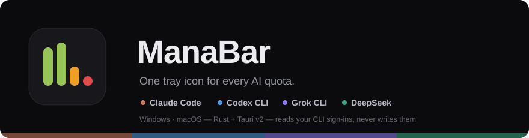
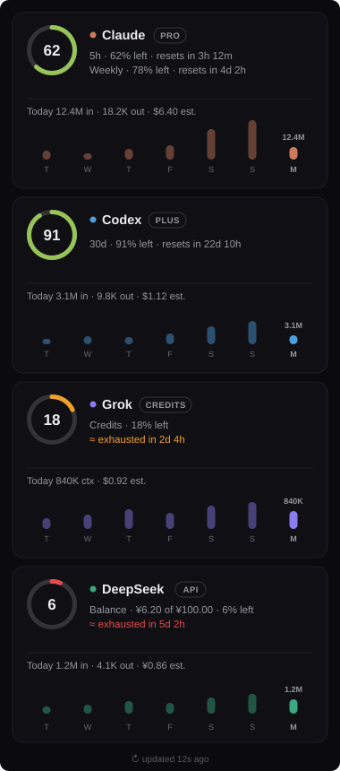
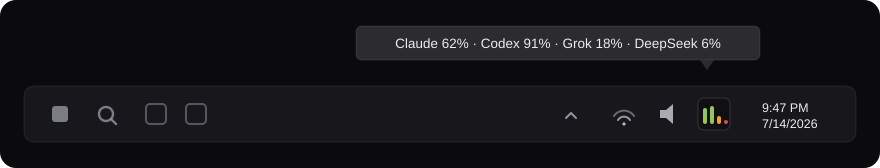
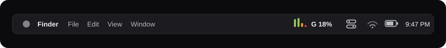

<div align="center">



[](https://github.com/arteeeezy/manabar/actions/workflows/ci.yml)
[](LICENSE)
[](https://github.com/arteeeezy/manabar/releases)

</div>

# ManaBar

Formerly QuotaBar — renamed in v0.6.0; config and state migrate
automatically from the old `%APPDATA%\quotabar` location, see
[Configuration](#configuration).

A Windows and macOS tray app that shows, at a glance, how much subscription
quota you have left on three AI coding assistants — **Claude Code**
(Anthropic), **Codex CLI** (OpenAI), and **Grok CLI** (xAI) — plus
**DeepSeek** account balance, via a flyout panel with per-window detail
and estimated token/cost usage over the last 7 days. On macOS the menu bar
can also show a letter + percent for whichever enabled provider is closest
to running out — see [macOS](#macos) below. The macOS build is compiled,
tested, and smoke-launched on GitHub Actions' Apple-silicon runners on every
release; final validation on physical Mac hardware is still pending.

<div align="center">
  
</div>

No click required to check quota: the tray icon itself is the status
readout, redrawn after every poll.

## Tray icon legend



The icon is one vertical bar per **enabled** provider, always in this
relative order: **Claude, Codex, Grok, DeepSeek**. A provider disabled via
`enabled.*` in config (see Configuration below) contributes no bar at
all — the icon narrows and re-centers rather than showing a placeholder,
so with e.g. only Claude and Grok enabled you get two centered bars, not
four with two grayed out. Bar height is remaining quota; bar color is
health, based on the *binding constraint* (the lowest remaining
percentage across that provider's rate-limit windows — for DeepSeek, its
single `Balance` window) against the configurable `thresholds`:

| Color | Meaning |
|---|---|
| green | remaining > `thresholds.amber` (default 30%) |
| amber | `thresholds.red` (default 10%) < remaining ≤ `thresholds.amber` |
| red | remaining ≤ `thresholds.red` (default 10%) |
| gray (dimmed, full-height) | unavailable — no credentials, expired sign-in, network error, or the endpoint's response no longer parses |

Hovering the icon shows a tooltip, e.g.
`Claude 82% · Codex 35% · Grok 95% · DeepSeek 60%` — an *enabled* provider
that's unavailable shows as `Codex —`, but a *disabled* provider doesn't
appear in the tooltip at all. Left-click opens the panel; right-click
gives `Refresh now`, an autostart toggle (`Start with Windows` on
Windows, `Start at Login` on macOS), and `Quit`.

## Requirements

- Windows 10/11, or macOS on Apple Silicon (see [macOS](#macos) below for
  install/Gatekeeper/menu-bar specifics).
- At least one of the following, signed in locally:
  - [Claude Code](https://docs.claude.com/en/docs/claude-code) (`%USERPROFILE%\.claude\`)
  - [Codex CLI](https://github.com/openai/codex) (`%USERPROFILE%\.codex\`)
  - [Grok CLI](https://github.com/superagent-ai/grok-cli) (`%USERPROFILE%\.grok\`)
  - [DeepSeek](https://platform.deepseek.com/) API key, optional, via the
    `DEEPSEEK_API_KEY` environment variable (or the `deepseek_api_key`
    config fallback) — DeepSeek has no local CLI/credential file; it's
    a bare API key against DeepSeek's own official balance endpoint.

  A provider you haven't installed/signed into (or, for DeepSeek, don't
  have a key for) just shows as unavailable (gray) — ManaBar doesn't
  require all four.

## Install

Prebuilt installers are attached to
[Releases](https://github.com/arteeeezy/manabar/releases) — a Windows
NSIS setup, a portable single-file exe, and a macOS `.dmg` with a
terminal one-liner installer (see [macOS](#macos)). On Windows you can
also build from source:

```bash
git clone https://github.com/arteeeezy/manabar.git
cd manabar
npm install
npm run tauri build
```

This produces two bundles under the workspace target directory:

- NSIS installer: `target/release/bundle/nsis/ManaBar_<version>_x64-setup.exe`
- MSI installer: `target/release/bundle/msi/ManaBar_<version>_x64_en-US.msi`

Run either one and ManaBar starts in the tray. The NSIS installer is
per-user (no admin required, installs under `%LOCALAPPDATA%`); the MSI is
per-machine (elevation prompt, installs to `C:\Program Files\ManaBar`).
To uninstall, use Windows' "Add or remove programs", or run
the uninstaller next to the installed exe (NSIS default:
`%LOCALAPPDATA%\ManaBar\uninstall.exe`).

**Portable:** no-install option — download `ManaBar_<version>_portable.exe`
from [Releases](https://github.com/arteeeezy/manabar/releases) and run it
directly; there's nothing to install or uninstall. Config still lives in
`%APPDATA%\manabar` (same place as the installed builds), so settings
carry over if you later switch to an installer build. Because the
autostart toggle registers the exe's *current* path, re-toggle
**Start with Windows** after moving the portable exe to wherever it'll
permanently live. This portable exe is built by CI on the MSVC
toolchain, which statically links `WebView2Loader` — it's genuinely
single-file. That's not true of a locally-built GNU-toolchain exe; see
the GNU-toolchain note just below, where `WebView2Loader.dll` still has
to sit next to it.

Note for GNU-toolchain builds: if you compile with
`x86_64-pc-windows-gnu` instead of the default MSVC toolchain, install
from the MSI — the NSIS bundle currently omits `WebView2Loader.dll`,
which GNU builds load dynamically, and the installed app will fail to
start without it. MSVC builds link it statically and are unaffected.
The same applies to running `target/release/manabar.exe` directly on a
GNU toolchain ("The code execution cannot proceed because
WebView2Loader.dll was not found"): copy the DLL next to the exe once —

```bash
cp target/release/build/webview2-com-sys-*/out/x64/WebView2Loader.dll target/release/
```

**Single instance:** ManaBar only ever runs one copy at a time. Launching
it again — portable exe or installed shortcut — doesn't spawn a second
tray icon; it just brings the existing instance's panel to the front.

## macOS



macOS support targets Apple Silicon (arm64) only; Intel (x86_64), code
signing/notarization, and the App Store are out of scope for now.

- **Install / upgrade (terminal, recommended):** no prerequisites —
  install or upgrade to the latest release in one command:

  ```bash
  curl -fsSL https://raw.githubusercontent.com/arteeeezy/manabar/main/scripts/install-mac.sh | bash
  ```

  This downloads the latest `.dmg` release asset, replaces
  `/Applications/ManaBar.app`, strips the Gatekeeper quarantine
  attribute (`xattr -dr com.apple.quarantine`) so there's no
  right-click-Open dance, and launches the app. Re-run the same
  command any time to upgrade to the newest release.
- **Install (manual, fallback):** download the `.dmg` from
  [Releases](https://github.com/arteeeezy/manabar/releases), open it,
  and drag `ManaBar.app` into `Applications` (or run it directly from
  the mounted volume). The build is unsigned/not notarized, so
  Gatekeeper blocks a plain double-click the first time —
  **right-click `ManaBar.app` → Open**, then confirm in the dialog
  (or, if that dialog doesn't appear, allow it via **System
  Settings → Privacy & Security → "Open Anyway"**). This is only needed
  once; subsequent launches (including autostart) work normally.
- **Menu bar icon + text:** the tray shows the same four health-colored
  bars as Windows, plus — when `menubar_text` is enabled (default) — a
  text label next to the icon: `{letter} {percent}%` for whichever
  *enabled* provider is currently the binding constraint (lowest remaining
  percent). Letters: **C**=Claude, **X**=Codex, **G**=Grok,
  **D**=DeepSeek. If the binding provider is unavailable it shows
  `{letter} —`; if every enabled provider is unavailable it shows a plain
  `—`. Set `"menubar_text": false` in config for an icon-only menu bar.
  Clicking the icon opens the panel anchored just below the menu bar
  (top-right), rather than above the taskbar as on Windows.
- **Claude credentials via Keychain:** some Claude Code installs on macOS
  store the OAuth token in the login Keychain (service
  `Claude Code-credentials`) instead of the plaintext
  `~/.claude/.credentials.json` file used elsewhere. ManaBar checks the
  file first and only falls back to reading the Keychain entry (via the
  `security` CLI, read-only, same as the file path) when the file doesn't
  exist — no extra unlock step should be needed beyond your normal login
  session.
- **Sign-in refresh:** the tray's `Refresh sign-in` action spawns
  `claude`/`grok` through a `/bin/zsh -lc` login shell (GUI apps on macOS
  don't inherit your Terminal's `PATH` by default), matching the same
  fixed, trivial prompt used on Windows.

## Configuration

ManaBar reads `%APPDATA%\manabar\config.json` once at startup (on macOS:
`~/Library/Application Support/manabar/config.json`) — created with
defaults on first run if missing; invalid JSON falls back to defaults
rather than crashing. There is no in-app settings UI in v1 — edit the
file and restart ManaBar for changes (including `poll_interval_secs`) to
take effect. `Refresh now` does not reload config; it only triggers an
immediate extra poll using the interval already in memory.

**Upgrading from QuotaBar:** on first launch after the v0.6.0 rename, if
`%APPDATA%\manabar\config.json` (and `state.json`) don't exist yet but the
old `%APPDATA%\quotabar\` versions do, they're copied over automatically —
one-way and non-destructive, the old files are left in place untouched.
No action needed; this happens transparently on startup.

```json
{
  "poll_interval_secs": 1800,
  "enabled": {
    "claude": true,
    "codex": true,
    "grok": true,
    "deepseek": true
  },
  "price_overrides": [
    {
      "model_contains": "claude-opus",
      "input": 15.0,
      "output": 75.0,
      "cache_read": 1.5,
      "cache_write": 18.75
    }
  ],
  "deepseek_api_key": null,
  "deepseek_budget": null,
  "thresholds": {
    "amber": 30.0,
    "red": 10.0
  },
  "menubar_text": true
}
```

| Field | Type | Default | Meaning |
|---|---|---|---|
| `poll_interval_secs` | number | `1800` | Seconds between quota-endpoint polls. `0` enables **on-demand mode**: no periodic background polling — ManaBar polls once at startup (so the tray has a baseline), then refreshes only when the panel is opened or tray `Refresh now` is clicked; tray levels stay at their last-known value between opens. Values 1-59 are clamped to 60. Opening the panel triggers an immediate usage refresh plus a quota poll; tray `Refresh now` triggers an immediate quota poll. |
| `enabled.claude` / `enabled.codex` / `enabled.grok` / `enabled.deepseek` | bool | `true` | Set to `false` to fully hide that provider: no tray bar (the icon narrows and re-centers around the remaining bars) and no panel card. Polling for it stops entirely — this isn't a display-only toggle. |
| `price_overrides` | array | `[]` | Per-model USD price overrides (per million tokens: `input`, `output`, `cache_read`, `cache_write`). `model_contains` is a substring match checked before the built-in price table, first match wins. |
| `thresholds.amber` / `thresholds.red` | number | `30.0` / `10.0` | Health-color boundaries, as a remaining-percent cutoff: green above `amber`, amber above `red`, red at or below `red`. Must satisfy `0.0 ≤ red < amber ≤ 100.0` — an invalid combination (inverted/equal, negative, or over 100) is logged as a warning and the built-in 30/10 defaults are used instead for that run. |
| `deepseek_api_key` | string or `null` | `null` | Fallback DeepSeek API key, used only when the `DEEPSEEK_API_KEY` environment variable isn't set (or is blank). The environment variable always wins when present. |
| `deepseek_budget` | number or `null` | `null` | Optional total balance budget (same currency as your DeepSeek account, e.g. CNY) for turning the `Balance` window into a real used-percent gauge: `used% = (1 - balance/budget) × 100`, clamped 0-100. Without a budget, DeepSeek's card is a binary green/red signal from the account's own `is_available` flag — 0% used while usable, 100% once DeepSeek reports it can't serve requests. |
| `menubar_text` | bool | `true` | **macOS only** (ignored on Windows). Shows `"{letter} {percent}%"` next to the tray icon in the menu bar for the binding provider — see [macOS](#macos) above. Set to `false` for an icon-only menu bar. |

## How it works

ManaBar never asks you to sign in. It reads the credential files your
CLIs already maintain (read-only, never written or refreshed) and calls
the same unofficial usage endpoints those CLIs use internally:

| Provider | Credentials (read-only) | Quota endpoint | Cumulative usage source |
|---|---|---|---|
| Claude Code | `%USERPROFILE%\.claude\.credentials.json` (macOS: falls back to the login Keychain entry `Claude Code-credentials` when that file doesn't exist — see [macOS](#macos)) | `GET https://api.anthropic.com/api/oauth/usage` (Bearer token + `anthropic-beta: oauth-2025-04-20`) — primary: `limits[]` array (`session` / `weekly_all` / `weekly_scoped`, the latter carrying a per-model `scope.model.display_name` weekly window); fallback: legacy `five_hour`, `seven_day`, `seven_day_sonnet`, `seven_day_opus`, `extra_usage`; plan from `subscriptionType` | `%USERPROFILE%\.claude\projects\**\*.jsonl` |
| Codex CLI | `%USERPROFILE%\.codex\auth.json`, or `$CODEX_HOME\auth.json` when the `CODEX_HOME` environment variable is set | `GET https://chatgpt.com/backend-api/wham/usage` (Bearer token) — `rate_limit.primary_window` (5h), `secondary_window` (weekly), `additional_rate_limits[]` (per-model, paid plans) | `%USERPROFILE%\.codex\sessions\**\*.jsonl` |
| Grok CLI | `%USERPROFILE%\.grok\auth.json` (keyed by `issuer::client_id`, token field `key`) | `GET https://cli-chat-proxy.grok.com/v1/billing?format=credits` (`config.creditUsagePercent`, `currentPeriod.end`) + `GET .../v1/settings` (plan label) | `%USERPROFILE%\.grok\sessions\**\signals.json` (`contextTokensUsed`, `primaryModelId`) |
| DeepSeek | `DEEPSEEK_API_KEY` environment variable, or `deepseek_api_key` in config | `GET https://api.deepseek.com/user/balance` (Bearer token) — **the one official, documented endpoint of the four**; `balance_infos[0].total_balance` (a string) becomes the `Balance` window and the plan pill (e.g. `¥42.50`) | none — DeepSeek's card has no usage/sparkline block (`usage: null`); driven internally by omp, out of scope |

Claude, Codex, and Grok's endpoints are **unofficial** —
reverse-engineered from the CLIs' own network traffic, not documented
or supported by Anthropic, OpenAI, or xAI. DeepSeek's `/user/balance`
is the exception: it's official and documented. The unofficial
endpoints can change or be gated at any time without notice. When that
happens, ManaBar doesn't guess: a response that returns `2xx` but no
longer parses puts that provider into a distinct `SchemaChanged` state,
shown in the tray as gray and in the panel as "Endpoint changed —
needs an update," rather than showing a silently wrong number. Other
failure states (`NoCredentials`, `TokenExpired`, `Network`) are
surfaced the same way, each with a specific fix hint. One provider
failing never affects the others.

Rate-limit windows (5h / weekly / per-model) are derived from each
response's own window metadata, not hard-coded — a free-plan account
that only exposes one 30-day window is rendered as one window, not
padded out to match a paid plan's shape.

### Cost estimates

The panel's cumulative cost numbers are **estimates**: token counts
parsed from each CLI's own local session logs, multiplied by a static
per-model price table (`crates/manabar-core/src/pricing.rs`),
overridable via `price_overrides` in the config. They are not billing
data and won't exactly match your provider invoice. Grok's usage is
credits-based rather than token-priced, so its panel shows token counts
only — cost is displayed as "—". DeepSeek has no local session-log
source at all (it's driven internally by omp), so its card omits the
usage/sparkline block entirely — its own account balance is the whole
story.

## Burn-rate ETA and low-quota notifications

Each panel window line can append a `· runs out ~14:32` estimate: a linear
projection from the last two polls of that window (`(curr_used - prev_used)
/ Δt`), shown only when the projected exhaustion time is earlier than the
window's own reset. It needs **at least two polls at least 60 seconds
apart** to have a rate to fit — on a fresh install, or right after a poll
interval change, the first poll has nothing to compare against, so no ETA
shows yet. In on-demand mode (`poll_interval_secs: 0`) that means opening
the panel twice; the same applies after a data gap longer than 48 hours,
which is treated as stale rather than extrapolated from.

The last two samples per provider+window are persisted to
`%APPDATA%\manabar\state.json` (next to `config.json`, but shell-managed —
not meant to be hand-edited) so the estimate survives app restarts instead
of resetting to nothing every launch.

ManaBar also sends a Windows notification the moment a provider's health
*worsens* into amber or red (not on every poll while it stays amber/red, and
not on improvement) — e.g. `Claude: 28% left (5h), runs out ~14:32`. Like
everything else, this only fires when a poll actually happens: in on-demand
mode that's startup, panel open, or `Refresh now` — there is no hidden
background polling to enable notifications between those events.

## Development

```bash
npm install                 # frontend deps
cargo test --workspace      # unit + integration tests (manabar-core + src-tauri)
cargo fmt --check           # formatting
cargo clippy --workspace --all-targets -- -D warnings
npm run tauri dev           # run the app locally
npm run tauri build         # release build + NSIS/MSI installers
```

`manabar-core` is a plain Rust library crate (no Tauri dependency), so
its provider parsers and quota/usage math are unit-testable without a
GUI. Provider integration tests use `wiremock` fixtures for the happy
path, 401, timeout, and malformed-JSON cases.

Three tests hit real endpoints with your local, already-signed-in
credentials and are `#[ignore]`d by default — run them manually to
smoke-test against the live services after a suspected upstream change:

```bash
cargo test --workspace -- --ignored live_
```

## License

MIT — see [LICENSE](LICENSE).
